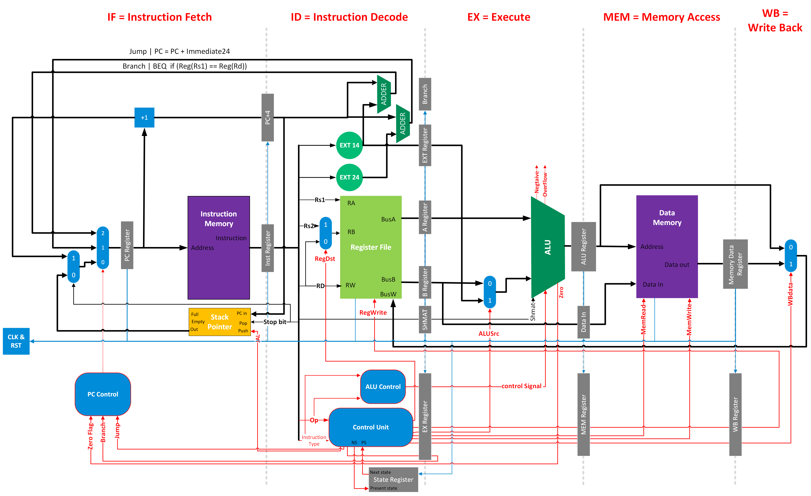

# Multi-Cycle Processor Design 💻

This repository contains the source code and documentation for a multi-cycle processor design. The processor is implemented in Verilog and consists of various modules that work together to execute different types of instructions.

## Project Overview 🚀

The objective of this project was to design and verify a simple RISC processor in Verilog. The processor specifications include a 32-bit instruction size, 32 general-purpose registers (R0 to R31), special purpose registers like the program counter (PC) and stack pointer (SP), and four instruction types (R-type, I-type, J-type, S-type), among other features.

## Instructions and Formats

The project implements four instruction formats: R-type, I-type, J-type, and S-type. Each format has specific fields, such as source registers, destination registers, immediates, and shift amounts. The processor supports various instructions like AND, ADD, SUB, CMP, ANDI, ADDI, LW, SW, BEQ, J, JAL, SLL, SLR, SLLV, SLRV, each with its corresponding function and behavior.

## Data Path

## Verification and Testing

The RTL design is verified using a testbench. Various code sequences in the given ISA are executed, and their results are shown using waveform diagrams. The processor's correctness is tested through simulation, and both successful and problematic instructions are identified.

## Project Report

For detailed information about the project's design, implementation, simulation, and testing, refer to the [Project Report](./Project-Report.pdf) document.

This project was completed as part of the ENCS4370 Computer Architecture course during the Spring Semester of 2022/2023.
